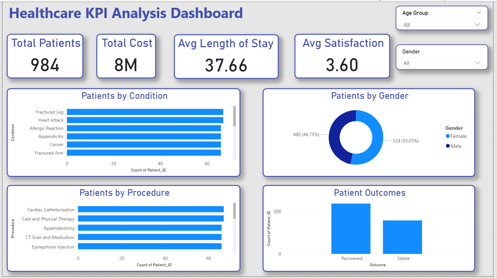
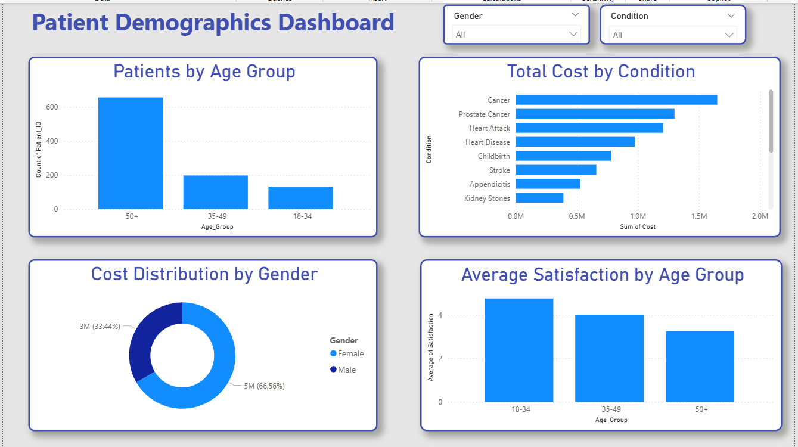
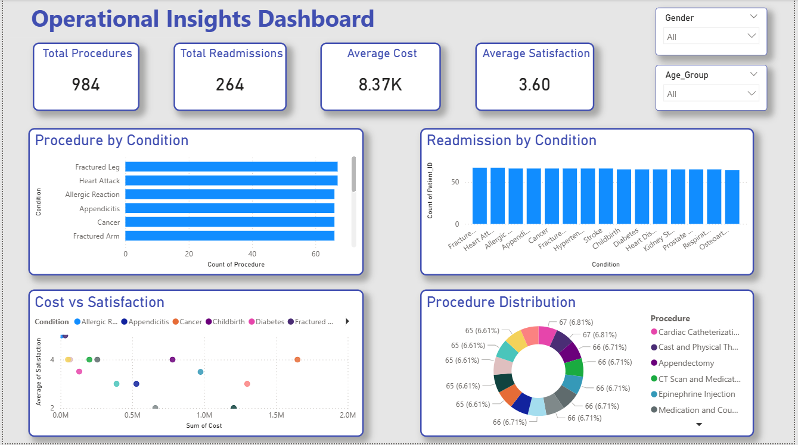

# Healthcare KPI Dashboard (Power BI)

This project presents a multi-page healthcare analytics dashboard built using Power BI to analyze hospital performance, patient demographics, treatment costs, and operational efficiency.

---

## Power BI File

Download the dashboard file here:

[Healthcare_KPI_Dashboard.pbix](Healthcare_KPI_Dashboard.pbix)

---

## Tools Used
- Power BI
- DAX
- Data Visualization
- Interactive Filters
- Data Modeling

---

## Dashboard 1 — Hospital Overview

This dashboard provides a high-level overview of hospital performance.

### KPIs
- Total Patients
- Total Cost
- Average Length of Stay
- Average Patient Satisfaction

### Visualizations
- Patients by Condition
- Patients by Gender
- Patients by Procedure
- Patient Outcomes

### Purpose
Provides a quick overview of hospital operations and patient outcomes.

---

## Dashboard 2 — Patient Demographics

This dashboard focuses on analyzing patient demographics and healthcare costs.

### Visualizations
- Patients by Age Group
- Total Cost by Condition
- Cost Distribution by Gender
- Average Satisfaction by Age Group

### Purpose
Helps understand patient distribution and financial trends across demographics.

---

## Dashboard 3 — Operational Insights

This dashboard focuses on operational efficiency and treatment patterns.

### KPIs
- Total Procedures
- Total Readmissions
- Average Cost per Patient
- Average Satisfaction Score

### Visualizations
- Procedures by Condition
- Readmissions by Condition
- Cost vs Satisfaction
- Procedure Distribution

### Purpose
Helps evaluate hospital operations and treatment effectiveness.

---

## Key Insights

- Some medical conditions contribute to the majority of hospital cases.
- Certain treatments generate higher overall healthcare costs.
- Older age groups represent a significant portion of patients.
- Readmission rates vary across different medical conditions.
- Patient satisfaction remains relatively stable across demographics.

---

## Project Objective

The goal of this project is to demonstrate how healthcare data can be transformed into actionable insights using Power BI dashboards. The project highlights data visualization, KPI tracking, and interactive filtering techniques used in healthcare analytics.
